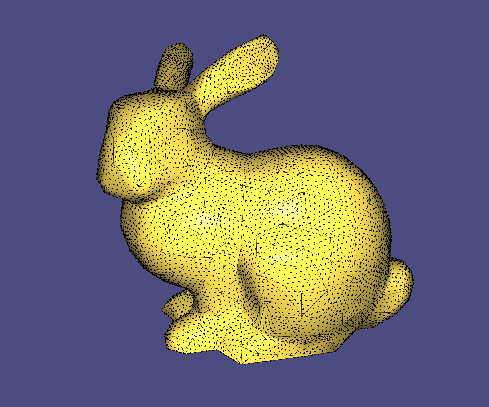

# Single Level Successive Self-Parameterization
## Compilation
To run this example, compile in release mode using the following typical cmake/make build routine:
```
cd 01_single_SSP
mkdir build
cd build
cmake -DCMAKE_BUILD_TYPE=Release ..
make -j8
```
If all goes well, you should be able to find and run the executable `main_bin` directly with no arguments.

## Demo


Show the construction of our prolongation opeartor and visualize it by mapping the fine mesh vertices onto the coarse mesh.