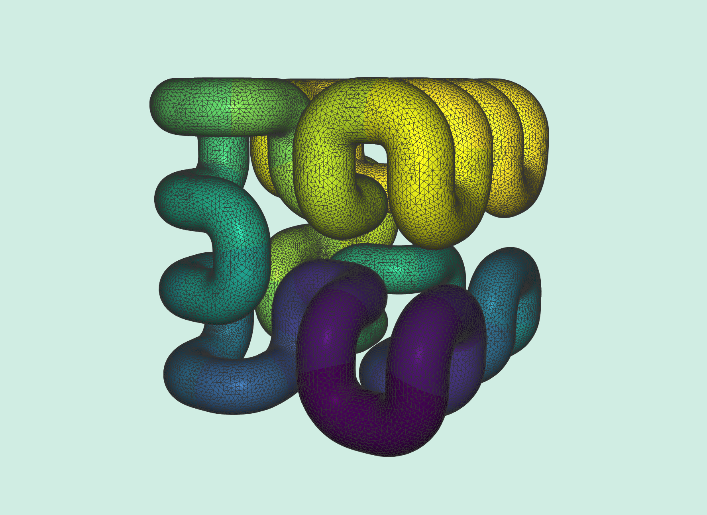

# Multigrid Solver on Meshes without Boundaries
## Compilation
To run this example, compile in release mode using the following typical cmake/make build routine:
```
cd 04_mg_solver_nobd
mkdir build
cd build
cmake -DCMAKE_BUILD_TYPE=Release ..
make -j8
```
If all goes well, you should be able to find and run the executable `main_bin` directly with no arguments.

## Demo

Show the usage of our multigrid solver on surface meshes without boundaries by solving a simple Poisson problem.