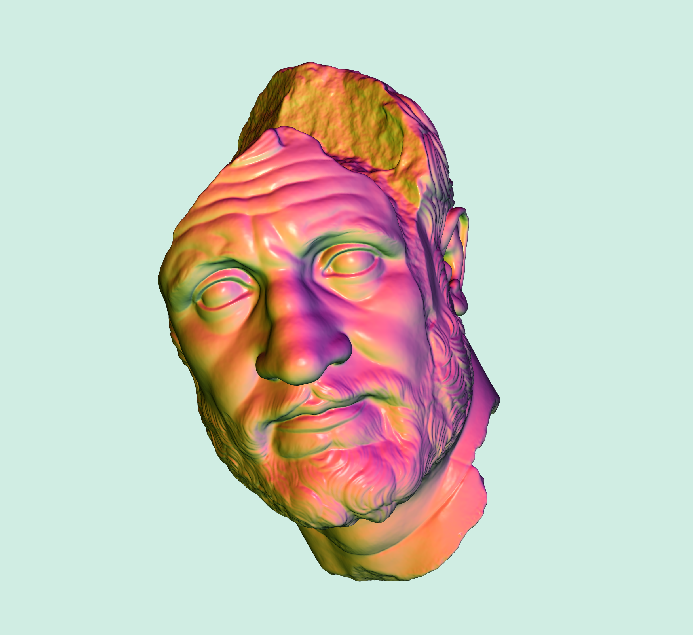
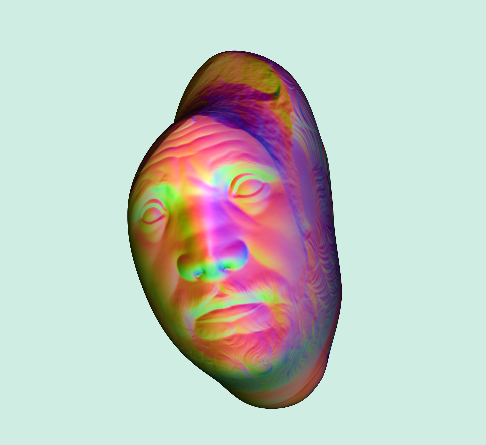

# Example - Mean Curvature Flow
## Compilation
To run this example, compile in release mode using the following typical cmake/make build routine:
```
cd 05_example_mean_curvature_flow
mkdir build
cd build
cmake -DCMAKE_BUILD_TYPE=Release ..
make -j8
```
If all goes well, you should be able to find and run the executable `main_bin` directly with no arguments.

## Demo
<p align="center"> 
  
<p>

Show the usage of our multigrid solver in a real-world application e.g. mean curvature flow. Press `[space]` to smooth and `[r]` to rest.