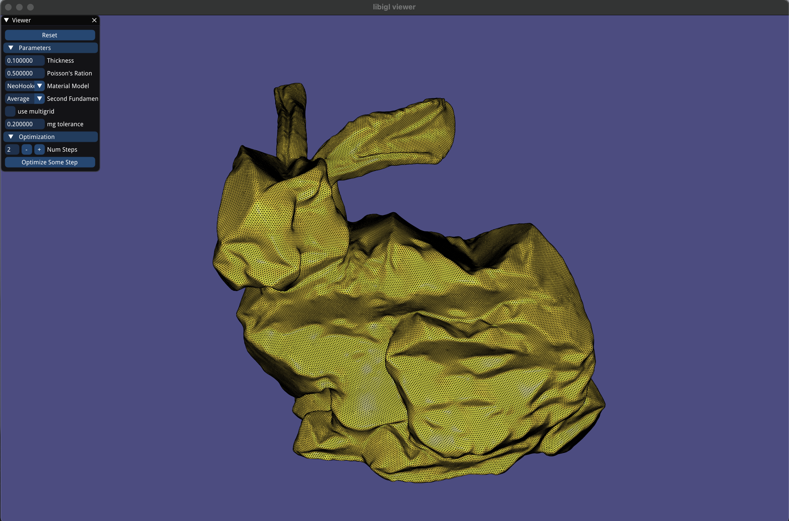

# Example - Balloon Simulation
## Compilation
To run this example, compile in release mode using the following typical cmake/make build routine:
```
cd 06_example_balloon_sim
mkdir build
cd build
cmake -DCMAKE_BUILD_TYPE=Release ..
make -j8
```
If all goes well, you should be able to find and run the executable `main_bin` directly with no arguments.

## Demo

Show the usage of our multigrid solver in a real-world example e.g. balloon simulation.

## Acknowledgement
Part of the simulation code is adapted from [libshell](https://github.com/evouga/libshell).