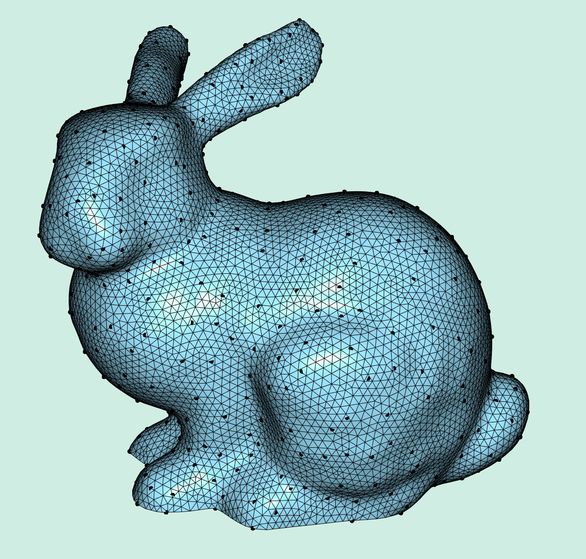

# Coarse-to-Fine Mapping with Successive Self-Parameterization
## Compilation
To run this example, compile in release mode using the following typical cmake/make build routine:
```
cd 07_coarse_to_fine
mkdir build
cd build
cmake -DCMAKE_BUILD_TYPE=Release ..
make -j8
```
If all goes well, you should be able to find and run the executable `main_bin` directly with no arguments.

## Demo


This demo shows how one can use our successive self-parameterization to map points on the coarse mesh to fine mesh, visualized as the black dots.