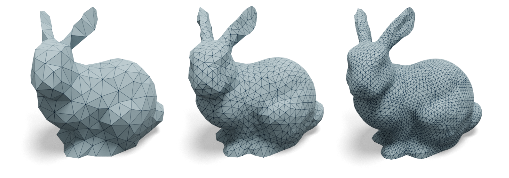

# Randomized Subdivision Remeshing
## Compilation
To run this example, compile in release mode using the following typical cmake/make build routine:
```
cd 09_random_subdiv_remesh
mkdir build
cd build
cmake -DCMAKE_BUILD_TYPE=Release ..
make -j8
```
If everything goes well, you should be able to find and run the executable with
```
./random_subdiv_remesh_bin [mesh_path] [target_faces] [number_subdivision] [random_seed]
```
For example, you can type in 
```
./random_subdiv_remesh_bin ../../meshes/bunny.obj 500 3 0
```
to run the code. This will output subdivision remeshing results stored as `output_s?.obj`. This randomized remeshing could be useful for generating training data for [neural subdivision](https://www.dgp.toronto.edu/projects/neural-subdivision/) or pre-process a mesh for architectures like the [SubdivNet](https://github.com/lzhengning/SubdivNet).

## Demo


This demo outputs similar subdivision remeshing results as `09_random_subdiv_remesh`, but with a randomized algorithm. 