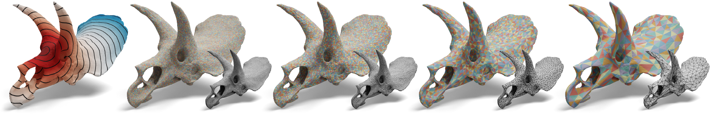

# Surface Multigrid via Intrinsic Prolongation


Public code release for [Surface Multigrid via Intrinsic Prolongation](https://www.dgp.toronto.edu/projects/intrinsic-prolongation/). For more details, please refer to:

**Surface Multigrid via Intrinsic Prolongation**<br>
[Hsueh-Ti Derek Liu](https://www.dgp.toronto.edu/~hsuehtil/), [Jiayi Eris Zhang](https://eriszhang.github.io/), [Mirela Ben-Chen](https://mirela.net.technion.ac.il/), and [Alec Jacobson](https://www.cs.toronto.edu/~jacobson/)<br>
ACM Transaction on Graphics (Proceedings of SIGGRAPH 2021)<br>
**[[Paper](http://www.dgp.toronto.edu/~hsuehtil/pdf/surfMG_65mb.pdf)]** **[[ArXiv](https://arxiv.org/abs/2104.13755)]** **[[Project Page](https://www.dgp.toronto.edu/projects/intrinsic-prolongation/)]**

## Installation
To get started, clone this repository *recursively*
```
git clone --recursive https://github.com/HTDerekLiu/surface_multigrid_code.git
```
On all platforms, we assume you have installed cmake and a modern c++ compiler on Mac OS X, Linux, or Windows.

The main folder contains 6 separate examples that demonstrate some core functionalities and typical usage of our code. All of them have a similar directory and file layout:
```
cmake/
  CMakeLists.txt
README.md
main.cpp
```
They share a common `src` folder for source code and a `meshes` for input meshes.